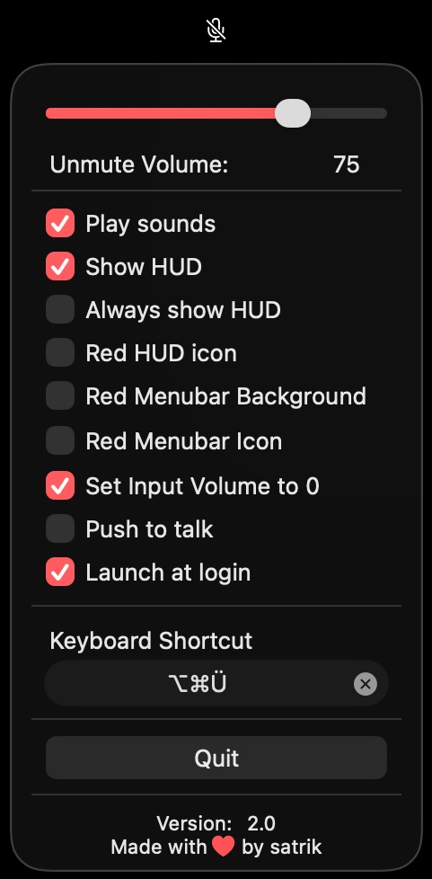
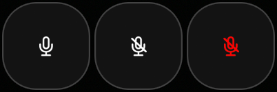

<p align="center">
   
</p>   
<h1 align="center">
   toggleMute
</h1>
<p align="center"> 
   <span>macOS Menu Bar App to mute/unmute the default microphone</span>
   <br><br>
   
   
   
   
</p>

> [!Important]  
> This app only mutes or unmutes the currently selected **default audio input device** on your Mac.  
> If you use an external device, you must set it as the default input device in **System Settings → Sound** for this app to work.

## Functions
- A single click on the Menu Bar icon toggles mute/unmute. The icon always reflects the current mute state.
- Right-clicking the Menu Bar icon opens the panel with all settings and controls:
   - **Unmute Volume** – sets the input volume that's applied every time you unmute, whether via the icon, the keyboard shortcut, or a hardware mute button. If the input volume gets changed elsewhere while unmuted, the app restores it to this value on the next unmute.
   - **Play sounds** – plays a short, distinct sound on mute and on unmute, so you always know your current state without looking.
   - **Show HUD** – briefly shows an on-screen overlay (similar to the system volume/brightness HUD) whenever the mic gets muted or unmuted.
      - **Always show HUD** – keeps the HUD permanently visible instead of fading out after a second.
      - **Red HUD icon** – tints the HUD icon red while muted.
      - **Show device name** – widens the HUD to show the name of the current input device next to the icon.
   - **Red Menubar Background** / **Red Menubar Icon** – optionally tint the Menu Bar icon and/or give it a red background while muted, for extra visibility at a glance.
   - **Set Input Volume to 0** – in addition to the normal mute, also sets the input volume to 0 while muted. Useful for devices/drivers that don't fully respect the standard mute signal.
   - **Push to talk** – hold the keyboard shortcut to go live only while it's held down; release to mute again immediately. (Push to talk only works via the keyboard shortcut, not by holding down the Menu Bar icon.)
   - **Launch at login** – does what it actually says.
   - **Keyboard Shortcut** – set a global shortcut to toggle mute from anywhere, even while another app is focused.
- Also works with most hardware mute buttons (e.g. on headsets): toggleMute detects the change and keeps the Menu Bar icon, HUD, and sound feedback in sync — even for devices that only signal mute by dropping their volume rather than using the standard CoreAudio mute flag.
- Checks for updates automatically (at launch, and at least once a day while running) and shows a notification if a new version is available on GitHub.

## Installation

### Homebrew

```shell
brew tap satrik/togglemute
brew trust --cask satrik/togglemute/togglemute
brew install togglemute
xattr -cr /Applications/toggleMute.app
```

## Manual Installation

- Download the toggleMute.dmg file from the latest release.
   - Alternatively, you can clone or download the repository.
- Mount toggleMute.dmg and move toggleMute.app to your Applications folder.
- Run (double-click) toggleMuteDisableQuarantine.command.
   - If this doesn’t work, execute xattr -cr /Applications/toggleMute.app in the Terminal.
- Launch the app for the first time via Right-click → Open and select Trust me

## Update
### Homebrew

```shell
brew update
brew updgrade
xattr -cr /Applications/toggleMute.app
```
> [!Important]  
> If you have problems with the HUD position in fullscreen apps, please go to `System Settings > Privacy & Security > Accessibility` and delete the toggleMute entry.
> Then just open the toggleMute settings and disable/enable _Show HUD_ to get the permissions again

### Manually 
Repeat the steps from the manually install section and replace the old app

## Preview:



Menubar Preview:


HUD Preview:


